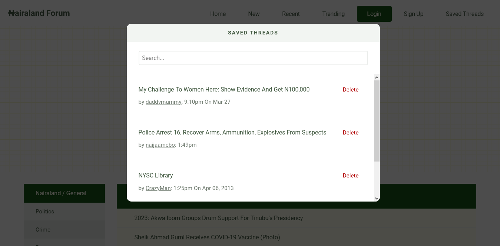

# Nairaland Plus
We have all learnt to live with [Nairaland's](https://www.nairaland.com) never-changing UI. Nairaland Plus gives you an alternative. All you have to do is [install](#how-to-install) and browse Nairaland like you normally would.

## How It Looks Now
### The Homepage

### A Thread

### Saved Threads

These are based on [@Ui_uxdesigner's](https://www.twitter.com/Ui_uxdesigner) designs which can be found [here](https://www.behance.net/gallery/93022789/Nairaland-Website-Redesign).

## How to Install
### Chrome
1. [Download ZIP](https://github.com/ajizanci/nairaland-theme/archive/main.zip) and unzip on your computer.
2. Visit `chrome://extensions` (or click Menu -> Tools -> Extensions).
3. Enable Developer mode by ticking the checkbox in the upper-right corner.
4. Click on the "Load unpacked" button in the top-left corner.
5. Select the **public** subdirectory of the downloaded folder. 

### Firefox Developer Edition
1. Install `web-ext` with `npm install --global web-ext`.
2. Clone this repo.
3. CD into the folder (with your terminal).
4. Run `npm install` to install the dependencies.
5. Run `npm run watch`.
6. CD into the **public** subdirectory.
7. Run `web-ext run`

## Disclaimer
I'm just messing around here😅. I thought this would be fun to build (after seeing this [tweet](https://mobile.twitter.com/Ui_uxdesigner/status/1264463867087925248)), so I'm building it. It's in no way affiliated with Nairaland.
